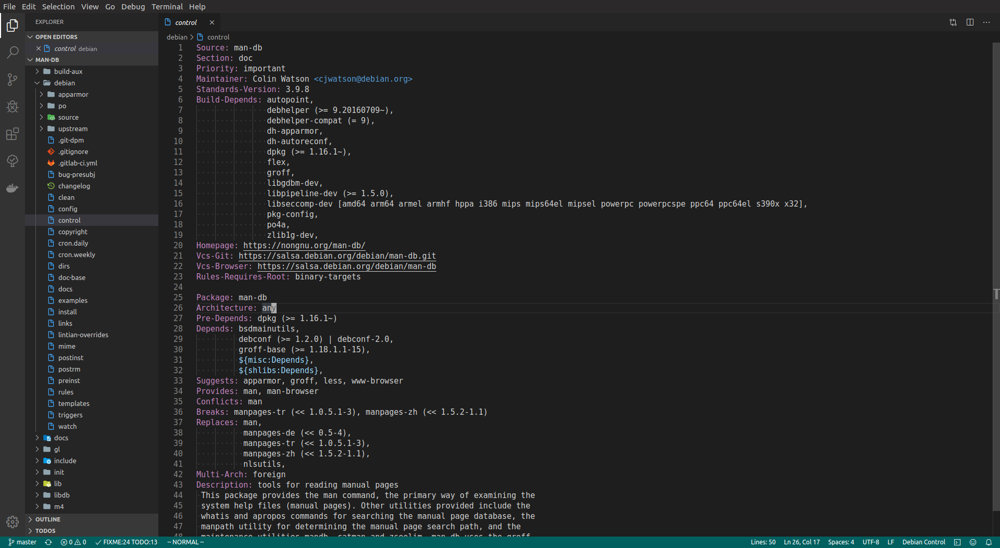
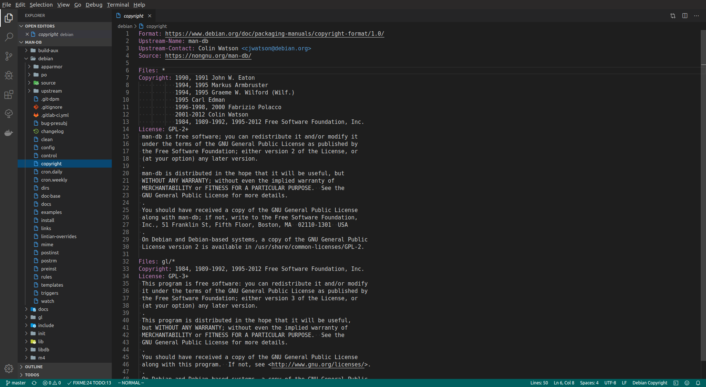
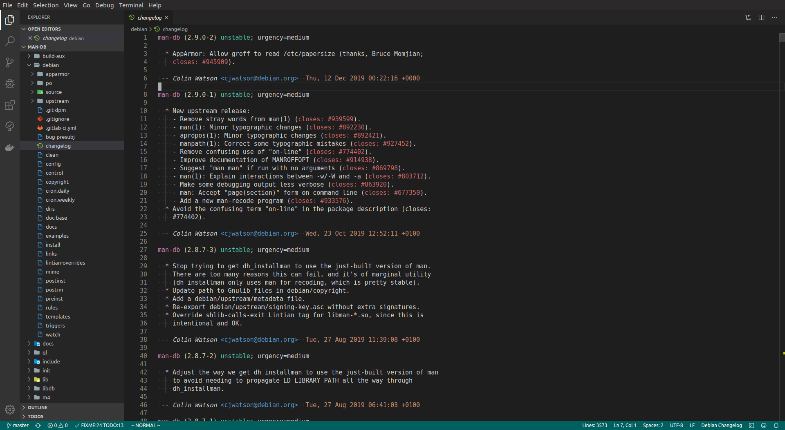

# debian-vscode

A Visual Studio Code extension adding syntax highlighting support for Debian packaging files. Currently implemented:

- `debian/control`
- `debian/copyright`
- `debian/changelog`
- `debian/upstream/metadata`

